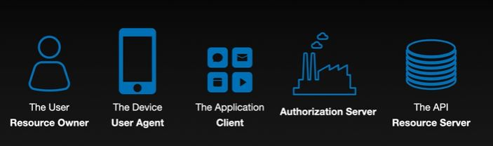

# The Nuts and Bolts of OAuth 2.0

a udemy course, $9.99USD, presentd by Aaron Parecki (OAuth Expert and Author)

## Section 1

### history

before oauth, many companys doing their own thing, all trying to solve the same basic problem

oauth 1.0 was drafted and deployed at twitter

oauth 2.0 easier to understand, bearer tokens, at scale, mobile apps, auth server vs api server, etc..

now there are plenty of extensions

- oauth for native apps
- oauth for smart tvs
- etc

### oauth vs openid

oauth originally designed for apis, auth doesnt really care who the user is
same as a hotel keycard. clerk at desk gives out the key card (access token), the door doesnt care who is using that key card

openid connect takes oauth as foundation and sprinkles on the flavor, user identity information on top

open id is an extension of oauth

### key take away

oauth issues access token
openid connect issues id tokens

oauth = Access
OpenID Connect = ID

oauth for accessing apis
OpenID Connect for identifying users

## Section 2

### terminolgy

user/device/app/api
resource owner/user agent/client/resource server

because the term application can mean many dirrent things to different people, its best to try not to use,

for oauth spec, application is the thing in the middle trying to access an api

authorization server manages access to the api it is protecting. auth server hands out the access token to the application.

Application never sees user password.

user redirect to the oauth server, gets a token that he brings back to the api

the above are roles, not necessarily distinct components

